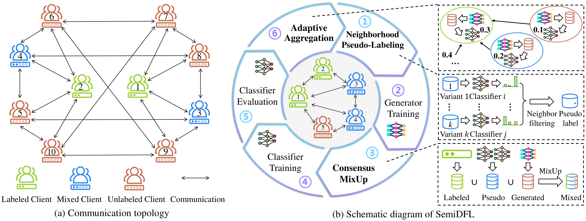
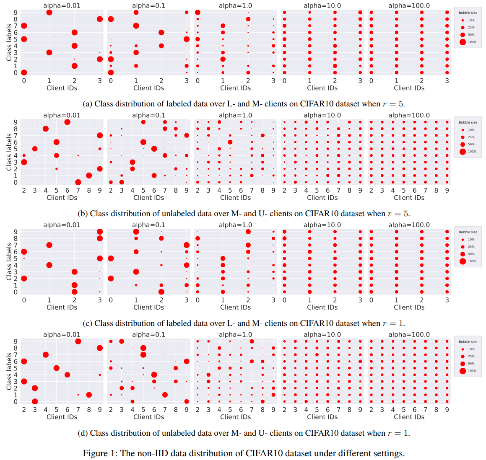
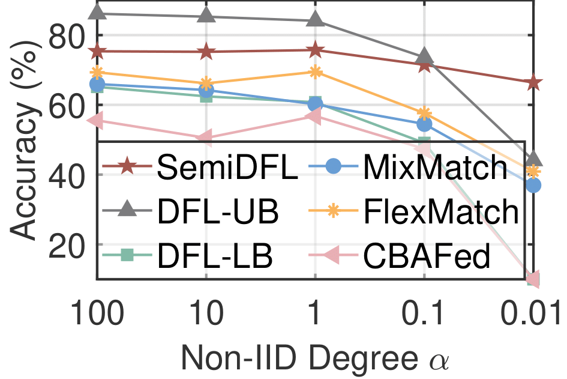
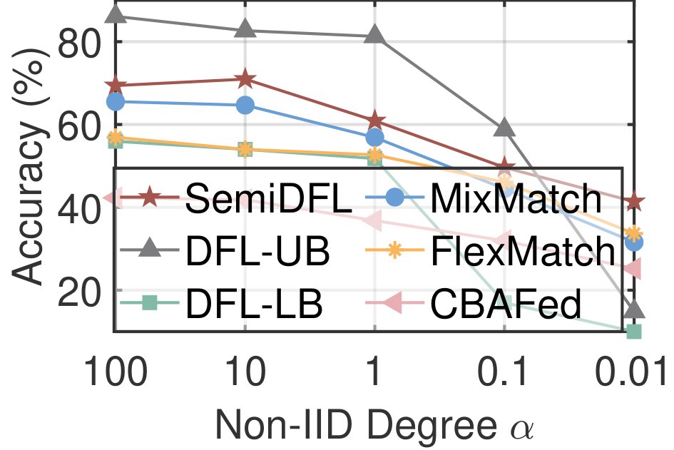
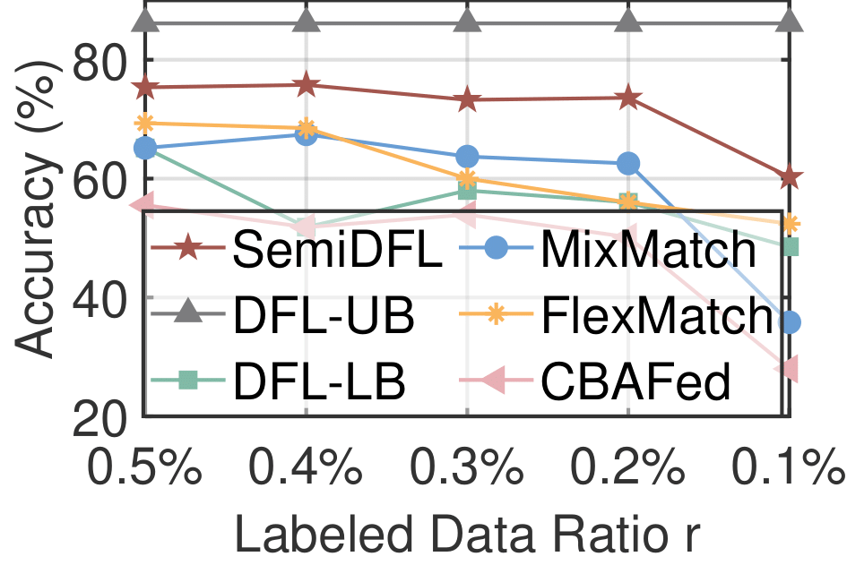
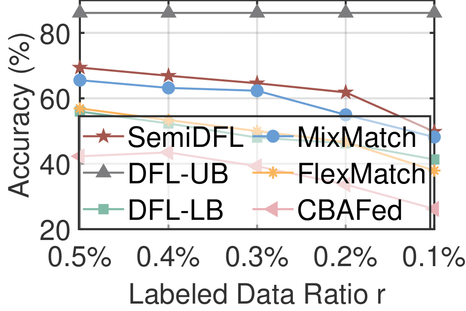

<h2 align="center">
    SemiDFL: A Semi-Supervised Paradigm for Decentralized Federated Learning
</h2>
<h5 align="center">
    Xinyang Liu<sup>1, 2, §</sup>, Pengchao Han<sup>3, §</sup>, Xuan Li<sup>4</sup>, Bo Liu<sup>1, †</sup> <br>
    <sup>1</sup>AIRS, <sup>2</sup>PolyU, <sup>3</sup>GDUT, <sup>4</sup>SEU <br>
    § Equal Contribution, † Corresponding Author <br>
</h5>

<h4 align="center">

[](https://arxiv.org/abs/2412.13589)
[](https://ojs.aaai.org/index.php/AAAI/article/view/34090)

</h4>

---
<br/>

### 📜 Introduction

SemiDFL introduces the first semi-supervised decentralized federated learning (DFL) framework, addressing the challenges
of limited labeled data and non-IID distributions among decentralized clients. By establishing consensus in both data
and model spaces, SemiDFL enhances the performance of clients with diverse data sources—labeled, unlabeled, or both—in
highly non-IID scenarios.

<div align="center">
    
</div>

### 🛠️ Environment

We recommend to create a virtual environment to avoid potential dependencies conflict:

```shell
conda create -n dfl python=3.9
conda install pytorch=2.1.2 torchvision torchaudio pytorch-cuda=11.8 -c pytorch -c nvidia
conda install scipy matplotlib numpy pandas tqdm
```

To ensure the shared memory can be used, you may need to execute the following commands:

```shell
# increase the number of open files in the current shell
ulimit -n 20000
# or permanently modify the configuration file and reboot
sudo vim /etc/security/limits.conf
# add the following content
* soft nproc 65535
* - nofile 20000
```

When the GPU memory is insufficient, you can try the following command:

```shell
export PYTORCH_CUDA_ALLOC_CONF=expandable_segments:True
```

### 📊 Dataset partition

We have uploaded the [dataset partition index files](https://huggingface.co/datasets/EZ4Lionky/SemiDFL/tree/main) to
help reproduce the results in the original paper.

The visualization of non-iid distribution on CIFAR10 dataset is shown as follows:
<div align="center">
    
</div>

You could generate the random dataset partition by running the script "LMUDatasetGeneration.py":

```shell
python LMUDatasetGeneration.py --task fashion --dist_wm_id 1 --label_ratio 0.5
```

### 💻 Experiments

To reproduce the results reported in the original paper, you could refer to the "SemiDFL.py" or directly run the example
command such as:

```shell
python DistSys.py --model cnn --task mnist --ssl_method DFLSemi --epoch_iteration_num 25 --label_ratio 0.1 --non_iid_alpha 100
```

More detailed parameters could be found and modified in the "GlobalParameters.py".

The visualizations below demonstrate the performance of different methods on Fashion-MNIST and CIFAR-10 datasets with
different label ratio and non-IID degree settings. SemiDFL could achieve better performance consistently.
<div style="display: flex; justify-content: space-between;">
  <figure style="text-align: center; width: 50%; ">
    
    <figcaption>(a) Fashion-MNIST (r=0.5%)</figcaption>
  </figure>
  <figure style="text-align: center; width: 50%; ">
    
    <figcaption>(b) CIFAR-10 (r=5%)</figcaption>
  </figure>
</div>

<div style="display: flex; justify-content: space-between;">
  <figure style="text-align: center; width: 50%; ">
    
    <figcaption>(c) Fashion-MNIST (α=100)</figcaption>
  </figure>
  <figure style="text-align: center; width: 50%;">
    
    <figcaption>(d) CIFAR-10 (α=100)</figcaption>
  </figure>
</div>

### 📖 Citation

If you think our work is helpful, please consider citing or giving us a star.

```text
@inproceedings{liu2025semidfl,
  title={SemiDFL: A Semi-Supervised Paradigm for Decentralized Federated Learning},
  author={Liu, Xinyang and Han, Pengchao and Li, Xuan and Liu, Bo},
  booktitle={Proceedings of the AAAI Conference on Artificial Intelligence},
  volume={39},
  number={18},
  pages={18987--18995},
  year={2025}
}
```

### 🔗 Acknowledgement
We would like to sincerely thank the contributors of several open-sourced repos, 
including [DPM-Solver](https://github.com/LuChengTHU/dpm-solver), 
[Pytorch-GAN](https://github.com/eriklindernoren/PyTorch-GAN), 
for their invaluable contributions.